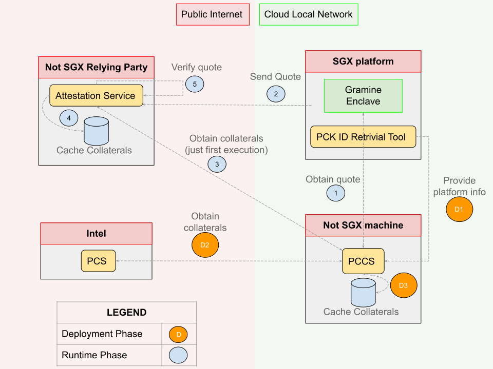

# Install and configure a complete Trust Execution Environment using Intel CPUs

## Introduction

The following guide is intended to assist in setting up several components that work together to ensure a Trusted Execution Enviroment (*TEE*) in a cloud provider. In particular we have used Gramine in conjunction with Intel Software Guard Extension (*SGX*) and a Data Center Attestation Primitives (*DCAP*) infrastructure to obtain the intended result.

- Intel SGX processors offer hardware-based memory encryption that isolates specific application code and data in memory. Intel SGXs allow allocate private areas of memory, called enclaves, designed to be protected from processes running at higher levels of privilege (such as the operating system).
- Gramine is a library Operating System that, among other things, has a special use case of SGX integration. More specifically it allows to run unmodified applications inside SGX.
- *DCAP* is a set of primitives that allows you to build your own infrastructure for the remote attestation. The attestation process serves to prove to a third-party that the enclave was built as intended and is running on a legitimate platform.
In short, the untrusted cloud service provider (SGX platform) attests to a relying party as follows:
  1. The cloud generates a quote which it sends to the relying party. The quote is signed and describes the trusted computing base (TCB) of the system and other useful information for the attestation process.
  2. The relying party receives the quote and verifies that the signature is from the legitimate SGX platform. Subsequently, if the signature is correct, the relying party check the information contained in the quote to decide whether to trust or not. For example, if the TCB is not updated, then the untrusted machine may not have security patches and the relying party may decide untrusting it.

  To carry out these operations (generation and verification of the quote), both parties require information that can be obtained by the Intel Provision Certification Service (*PCS*).
The PCS is an Intel service that generates signed collateral. To eliminate the need to contact the PCS at runtime, among the primitive DCAP, Intel has provided a Provision Certification Caching Service (*PCCS*) that acts as a proxy cache of the collaterals obtained from the PCS. Using PCCS, provisioning must only be done during the deployment phase and there is not need of internet live access at runtime.
In order for the PCCS to be able to request the SGX platform specific collateral, some hardware information must be provided. Again Intel helps accomplish this task through the use of a simple program, the PCK ID Retrieval tool.

### Goals

The cloud provider machines have to run SGX enclave and the PCCS. In order to do that we need setup on the cloud:
- SGX to run process inside an enclave
- DCAP components to generate the quote
- Gramine to run unmodified application inside Intel SGX enclaves

The relying party machine have to run a service for the remote attestation. To do that we need setup:
- DCAP components to verificate of the quote
- Gramine to get libraries for the process of the remote attestation

The final goal is obtain the following scheme:


### Useful Links
[Github Intel SGX Repository](https://github.com/intel/linux-sgx)

[Github Gramine Repository](https://github.com/gramineproject/gramine)

[Github DCAP Repository](https://github.com/intel/SGXDataCenterAttestationPrimitives/)

[Gramine Build and Installation](https://gramine.readthedocs.io/en/stable/devel/building.html)

[Intel SGX Software Installation Guide For Linux OS](https://download.01.org/intel-sgx/latest/dcap-latest/linux/docs/Intel_SGX_SW_Installation_Guide_for_Linux.pdf)

[Intel SGX DCAP Quick Install Guide](https://www.intel.com/content/www/us/en/developer/articles/guide/intel-software-guard-extensions-data-center-attestation-primitives-quick-install-guide.html)


## Setup SGX components on your cloud

### Prerequisites

- Linux kernel with SGX driver. That is available since the 5.11 kernel version
- Due to the use of built-in kernel SGX driver, the processor requires Flexible Launch Control (FLC) feature. Follow the [official documentation](https://www.intel.com/content/www/us/en/support/articles/000057420/software/intel-security-products.html) to check if this feature is available
- SGX features enabled in the BIOS

### Working environment

- Operating system: Rocky Linux 9.1 (Blue Onyx)
- Linux kernel version: 5.14.0
- CPUs: Intel(R) Xeon(R) Gold 6346

### Staging step

All the documentation needed for this section can be found in the following [Github repository](https://github.com/intel/linux-sgx). In order to setup SGX components, you have to:

1. Install the required tools:
```
dnf groupinstall 'Development Tools'
dnf install ocaml ocaml-ocamlbuild wget python3 openssl-devel git cmake perl \
openssl-devel libcurl-devel protobuf-devel cmake rpm-build createrepo yum-utils \
pkgconf boost-devel protobuf-lite-devel systemd-libs
```
2. Create an alternative for the python3 command:
```
alternatives --install /usr/bin/python python /usr/bin/python3 1
alternatives --set python /usr/bin/python3
```
3. Clone the repository for the source code:
```
git clone https://github.com/intel/linux-sgx
cd linux-sgx
```
4. Trigger trigger the script ```download_prebuilt.sh```:
```
make preparation
```
5. Copy the mitigation tools corresponding to current OS distribution from ```external/toolset/{current_distr}``` to ```/usr/local/bin``` and make sure they have execute permission. For example:
```
cp external/toolset/rhel8.6/* /usr/local/bin
which ar as ld objcopy objdump ranlib
```

### Build and install SDK

The easiest way to install the SDK is to build the installer directly:
```
make sdk_install_pkg
```

The generated Intel(R) SGX SDK installer (```sgx_linux_x64_sdk_${version}.bin```) is located under ```linux/installer/bin/```, where ```${version}``` refers to the version number, for example ```linux/installer/bin/sgx_linux_x64_sdk_2.19.100.3.bin```.

To install the SDK:
```
cd linux/installer/bin
./sgx_linux_x64_sdk_${version}.bin --prefix {SDK_INSTALL_PATH_PREFIX}
```

Finally, SDK require some environment variables to compile codes. The following command will run a bash script to setup these environment variables:
```
source ${sgx-sdk-install-path}/environment
```

### Build and install PSW

The easiest (and recommended) way to install the PSW is to build the local RPM package repository and then use it to install the required packages. In order to do that, you need:
1. Move in the root directory of the previously cloned repository
2. Build the local RPM package repository with the ```make rpm_local_repo``` command

Now, the local package repository is located under ```linux/installer/rpm/sgx_rpm_local_repo```. If you want to use it, you need to add it to the system repository configuration. Since the local package repository is not signed with GPG, you should ignore the gpgcheck when installing the packages with the ```--nogpgcheck``` option.

To add the local RPM package repository to the system repository configuration give the following command: 
```
sudo dnf config-manager --add-repo=file://PATH_TO_LOCAL_REPO
```

To install the Intel SGX PSW package from the the local RPM package repository, run the following command:
```
dnf install --nogpgcheck libsgx-urts libsgx-launch libsgx-epid  libsgx-quote-ex  libsgx-dcap-ql  \
libsgx-enclave-common-devel libsgx-dcap-ql-devel libsgx-dcap-default-qpl-devel libsgx-quote-ex-devel \
libsgx-launch-devel libsgx-epid-devel libsgx-dcap-quote-verify-devel
```

### Adjust User Group

On any distro with systemd v248 or later, ```/dev/sgx_enclave``` is only accessible by users in the group ```sgx```. The enclave app should be run with a uid in the sgx group:
```
# check systemd version:
systemctl --version

# add sgx group to user if it's 248 or above:
sudo usermod -a -G sgx <user name>
```

### Test the Intel SGX Setup

To check the previous installation, you can use the Intel samples located in ```${sgx-sdk-install-path}/SampleCode/```. In this folder there are many examples that can be built and run. For example to test the Local Attestation:
```
cd ${sgx-sdk-install-path}/SampleCode/LocalAttestation
make
cd bin
./app
```
TODO: successful output example

## Setup DCAP infrastructure on your cloud

We will install and configure a trivial but completely functional infrastracture for the remote attestation. You can follow this [official Intel guide](https://www.intel.com/content/www/us/en/developer/articles/guide/intel-software-guard-extensions-data-center-attestation-primitives-quick-install-guide.html).

Below is given an overview of the required steps:
1. Subscribe to the Intel PCS for ECDSA Attestation and obtain the required API keys
2. Set up the Provisioning Certification Caching Service (PCCS)
3. Provision the Intel SGX enabled platform for Intel SGX workloads

### Obtain API keys

To subscribe to PCS service and obtain the API keys, you need:
1. Go on the [API portal](https://api.portal.trustedservices.intel.com/)
2. Sign-in or Sing-up
3. Select the Intel® SGX Provisioning Certification Service
4. Subscribe to "Get PCK Certificate/s"
5. Follow the instruction to conclude the subscription

By doing this you will have obtained the keys that will be used to configure the PCCS

### Setup PCCS

As shown in the figure of the [goals section](#goals), the PCCS caching service resides within the local network of the cloud. In our case, PCCS is installed on a different machine (Ubuntu 22.04 LTS) than the SGX-enabled ones (Rocky Linux 9.1). However, this separation is not required and everything can be installed and configured in a single machine.

The PCCS package has a dependency on Node.js version 14, so the first step is to install it:
```
curl -o setup.sh -sL https://deb.nodesource.com/setup_14.x
$ chmod a+x setup.sh
$ sudo ./setup.sh
sudo apt-get -y install nodejs
```

In order to install the requested package we need to add the Intel repository to the apt sources list:
```
sudo su
echo 'deb [arch=amd64] https://download.01.org/intel-sgx/sgx_repo/ubuntu jammy main' > /etc/apt/sources.list.d/intel-sgx.list
wget -O - https://download.01.org/intel-sgx/sgx_repo/ubuntu/intel-sgx-deb.key | apt-key add -
apt update
```

Now you can install the PCCS package and some dependencies:
```
apt install build-essential cracklib-runtime
apt install sgx-dcap-pccs
```

Installing the package will run a script that will start asking ```Do you want to install PCCS now? (Y/N)```. After answering ```Y``` you can start configure the PCCS. The following table resume the configuration process:

|Configuration question|Setting|
|----------------------|-------|
|Enter your http proxy server address, e.g. http://proxy-server:port (Press ENTER if there is no proxy server) :| ```enter```|
|Do you want to configure PCCS now?|```Y```|
|Set HTTPS listening port (1024-65535)|```port number``` (default 8081)|
|Set the PCCS service to accept local connections only?|```N```|
|Set your Intel PCS API key|One of the two keys obtained in the [section obtain API keys](#obtain-api-keys)|
|Choose caching fill method|```REQ```|
|Set PCCS server administrator password|```choose password```|
|Re-enter administrator password|```re-enter password```|
|Set PCCS server user password|```choose password```|
|Re-enter user password|```re-enter password```|
|Do you want to generate insecure HTTPS key and cert for PCCS service?|```Y```|

Finally, you can start the PCCS service:
```
sudo systemctl start pccs
```

Useful information about PCCS:
- To better understand some of the settings above, such as the cache fill method, you can consult [Intel's official PCCS repository](https://github.com/intel/SGXDataCenterAttestationPrimitives/blob/master/QuoteGeneration/pccs/README.md)
- The passwords chosen during configuration are used by the pck-id-retrieval-tool to send the SGX platform data to the PCCS service ([explore the next section](#provision-intel-sgx-enabled-platform))
- We use a self-signed certificate, but a production environment will require a certificate that is signed by a recognized certificate authority.
- All configuration can be found in the ```/opt/intel/sgx-dcap-pccs/config/default.json``` file. If you modify this file, then you need to restart the PCCS service: ```sudo systemctl restart pccs```
- The log file is located in ```/opt/intel/sgx-dcap-pccs/logs/pccs_server.log```

### Provision Intel SGX enabled platform

The ```sgx-pck-id-retrieval-tool``` is provided by the local repository that we built in the [PSW section](#build-and-install-psw). So, in order to download it, just give the follwing command:
```
dnf install --nogpgcheck sgx-pck-id-retrieval-tool
```

The provisioning tool needs to communicate with the PCCS service, therefore it needs to be configured. To do that:
1. Move to the right working directory 
```
cd /opt/intel/sgx-pck-id-retrieval-tool/
```
3. Change the ```network_setting.conf``` file like follows:
  - The ```PCCS_URL``` have to match your caching service’s location
  - Uncomment the ```user_token``` parameter, and set it to the user password you created when configuring the PCCS ([PCCS section](#setup-pccs))
  - Set the ```proxy_type``` to fit your environment (most likely this will be "direct")
  - Ensure ```USE_SECURE_CERT``` is set to "FALSE" since we’re using a self-signed certificate
4. Add the current user to the ```sgx_prv``` group
```
sudo usermod -a G sgx_prv username
```
4. Close and re-open the terminal (group changes will take effect)
5. Run the provisioning tool
```
PCKIDRetrievalTool
```
Maybe there will be warnings, but the most important thing is to read "the data has been sent to the cache service successfully". This means that the provisioning tool was able to successfully contact the PCCS.

Just for completeness, the ```network_setting.conf``` file should look something like the following:
```
PCCS_URL=https://PCCS_IP_ADDRESS:8081/sgx/certification/v4/platforms
USE_SECURE_CERT=FALSE
user_token =CHOSEN_USER_PASSWORD_DURING_PCCS_CONFIG
proxy_type=direct
```

## Setup Gramine on your cloud

### Build

### Install

## Setup Relying Party Machine

